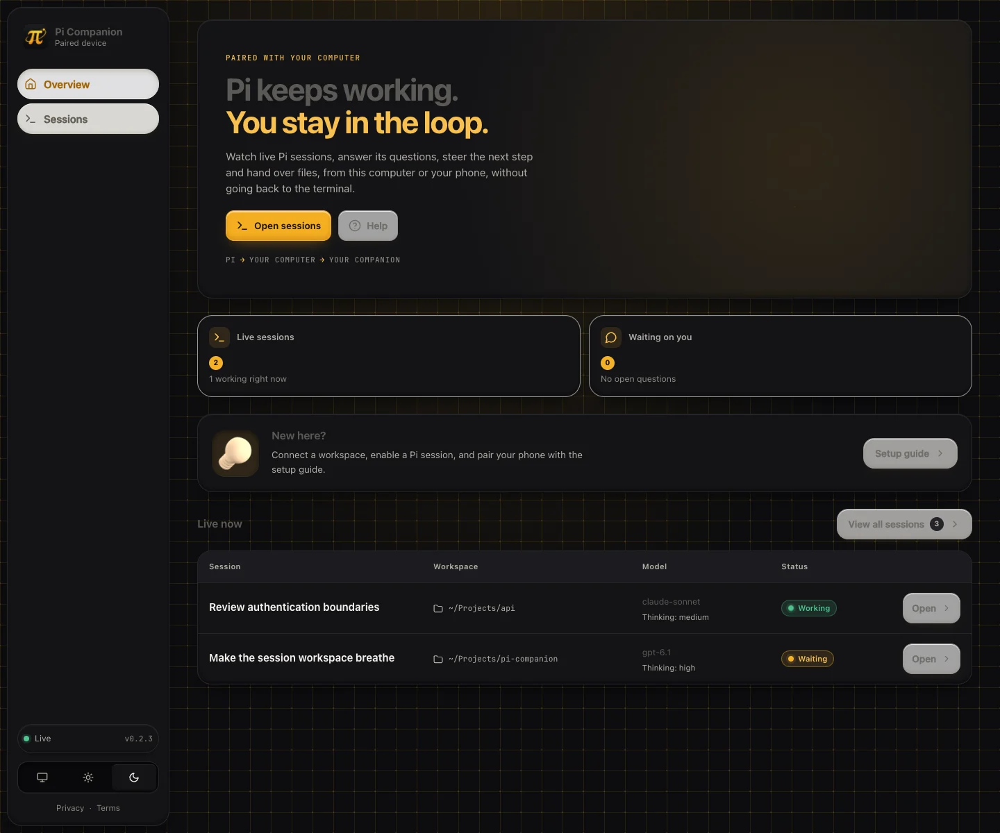
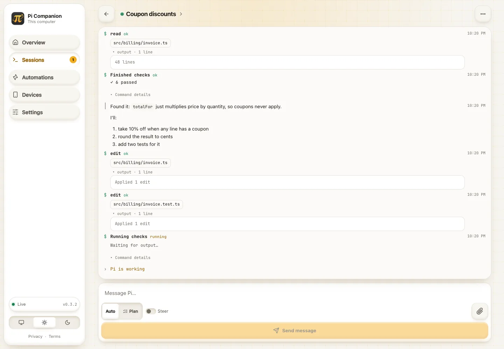
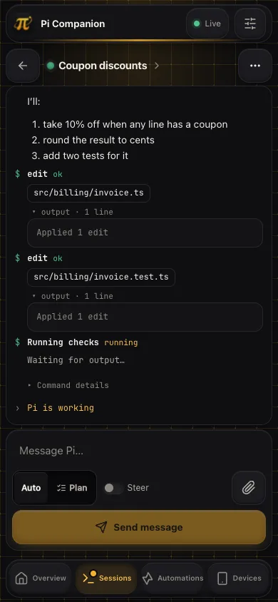

# Pi Companion

Lightweight, local-first remote control for Pi sessions.

**New in 0.3.5:** Shared files now have authenticated Download buttons, filename filtering, and You / Agent source badges. Custom terminal popups retain the scrollable claymorphism viewer and touch-friendly controls introduced in 0.3.4.

Filename search is case-insensitive. New browser uploads are marked **You**; local agent uploads can declare **Agent** by posting to `/api/sessions/{session_id}/files?source=agent`. This query is honored only on the local admin endpoint; remote uploads always remain user uploads. Older files without provenance show **Unknown**. Source badges describe upload provenance, not file-content authorship.

**New in 0.3.2:** responsive automation and run-history tables, rounded status chips, matching clay-icon headers, and a single-column automation workspace with full-width mobile controls. **Edit automation** scrolls to and focuses the inline editor. Pull to refresh Overview, Sessions, Automations, or Settings—with a gesture; unsaved settings stay intact. Camera-policy guidance now explains HTTPS proxy configuration. Existing rich results, staged job editing, optional retries, and answers-only automation sessions are retained. See [automations](docs/automations.md).

Pi Companion is deliberately not another agent runtime. Pi owns execution and conversation state. A single Rust daemon owns session discovery, pairing, temporary file exchange, browser fan-out, and the embedded web UI.

The UI is a static SvelteKit application. There is no Node runtime in production and no Tauri shell. Rust embeds the generated frontend into the daemon binary.



<p>
  
  
</p>

Screenshots use demo sessions, not private conversation data, and are regenerated with `node tools/screenshots.mjs` (see [Running locally from source](#running-locally-from-source)). See the [session menu](docs/session-menu.webp), [desktop session rows](docs/session-list-desktop.webp) and [mobile session list](docs/session-list.webp), plus [attachment previews](docs/attachments.webp), [file-grouped changes](docs/changes.webp) and [connection recovery](docs/connection-error.webp). Explore the new [automation list](docs/automations.webp), [summary](docs/automation-detail.webp), [run history](docs/automation-history.webp), [job editor](docs/automation-editor.webp), and [rich results](docs/automation-result.webp).

## Install

    pi install npm:@yunazgr/pi-companion

or straight from git:

    pi install git:github.com/ygrip/pi-companion

Then start Pi as usual. Installing the Pi extension is enough for normal use: the extension does not probe, connect to, download, or start a daemon until you run `/companion` in that session. On first use it downloads the matching sha256-verified daemon binary from GitHub Releases, caches it under `~/.pi/agent/pi-companion/bin/<version>/`, and reuses the same daemon across Pi sessions.

Use `/companion` in each session you want to share with paired devices. It enables remote access for that session and prints the local dashboard address. `/companion off` stops sharing that session.

You do **not** need to run `pi-companion-server` manually for a normal npm install. Manual daemon startup is mainly for local development, debugging, or when `PI_COMPANION_AUTOSTART=0` is set.

## Architecture

    local browser :43721
            |
            v
    +---------------------------+
    | pi-companion-server       |
    | single Rust daemon        |
    |                           |
    | live session registry     |
    | pairing/device registry   |
    | per-session temp sandbox  |
    +-------------+-------------+
                  |
          localhost WebSocket
        +---------+---------+
        v                   v
    Pi session A        Pi session B
    extension           extension

    paired phone
         |
      HTTPS/WSS
         |
    tunnel / reverse proxy
         |
         v
    remote surface :43722
         |
         +---- same daemon

The local administration surface and paired-device surface are separate listeners. If you expose Pi Companion through a tunnel, target only port 43722. Never expose port 43721.

## Install the web app on your phone

Open the daemon’s **HTTPS device URL** and pair the phone first. On Android/Chromium, choose **Install app** (or **Add to Home screen**) in the browser menu. On iPhone/iPad, open Safari and choose **Share → Add to Home Screen**; enable **Open as Web App** if offered. Installation does not grant additional session permissions.

Service workers require HTTPS; `http://localhost` is permitted for desktop development, but ordinary LAN HTTP addresses are not. An insecure-origin banner explains this in the UI. Install prompts vary by browser and may not appear inside in-app browsers.

After an online visit, the public app shell and visited immutable assets are cached. This is not an offline agent: sending, live activity, pairing, uploads and changes require the daemon connection. No credentials, API responses or session files are stored in the service-worker cache. Reopen online after an update to load the new build.

## How the daemon runs

For a normal install:

    pi install npm:@yunazgr/pi-companion

That is enough. Start Pi normally, then run `/companion` in the session you want to share. Only then does the extension connect or start the daemon on demand and keep its daemon version aligned with the installed extension. Updating the Pi package is therefore enough to update both pieces. You do not need a separate terminal, launch agent, system service, or manual `pi-companion-server` process.

The lifecycle is:

1. A Pi session loads the extension without daemon network or startup work.
2. You run `/companion` in that session; the extension probes `http://127.0.0.1:43721`.
3. If the daemon is already running, this opted-in session connects to it.
4. If not, the extension resolves the daemon binary, downloading the matching GitHub Release on first use if necessary.
5. It starts the daemon detached in the background.
6. Other Pi sessions reuse the same daemon only after their own `/companion` command. New sessions start disconnected, even when another session has enabled Companion.
7. On extension upgrades, the extension compares its package version with the running daemon. If they differ, it stops the old local daemon, resolves/downloads the matching release, and starts the new daemon automatically.
8. The daemon keeps running independently until it is stopped or the machine restarts.

There is exactly one daemon per machine, shared by every Pi session. The extension manages it with no configuration:

1. It probes http://127.0.0.1:43721. If anything answers (a daemon started by another session, or one you ran yourself with cargo run), it just connects. It never starts a second copy.
2. If nothing answers, one Pi session takes a lock (so several sessions starting at once don't race), launches the daemon detached, and waits for it to be ready. The others wait for that daemon.
3. If a live connection drops, the extension waits 20 seconds before launching a replacement, so restarting a dev daemon doesn't get pre-empted.
4. The daemon also refuses to run twice: if its ports are taken it prints a message and exits 0.

The daemon binary is resolved in this order:

| Order | Source |
|---|---|
| 1 | PI_COMPANION_SERVER (explicit path override) |
| 2 | a cargo build inside the package checkout: newest of server/target/release and server/target/debug |
| 3 | cached download: ~/.pi/agent/pi-companion/bin/<version>/ |
| 4 | pi-companion-server on PATH |
| 5 | download of the GitHub release matching the package version, verified against SHA256SUMS, then cached |

Optional environment variables (none are required):

| Variable | Effect |
|---|---|
| PI_COMPANION_SERVER | use this daemon binary |
| PI_COMPANION_URL | daemon WebSocket URL (default ws://127.0.0.1:43721); autostart only happens for loopback URLs |
| PI_COMPANION_AUTOSTART=0 | never launch a daemon, only connect |
| PI_COMPANION_PUBLIC_URL | daemon-side: public URL embedded in pairing QR codes |
| PI_COMPANION_ALLOWED_ORIGINS | daemon-side: extra comma-separated browser origins accepted besides the loopback addresses and the public URL |
| PI_COMPANION_ADMIN_ADDR, PI_COMPANION_DEVICE_ADDR | daemon-side: loopback listen addresses (default `127.0.0.1:43721` / `127.0.0.1:43722`), for running a second daemon next to the usual one, e.g. for screenshots. The extension still looks for 43721 unless `PI_COMPANION_URL` points elsewhere |

Local admin:

    http://127.0.0.1:43721

Paired-device surface:

    http://127.0.0.1:43722

The remote listener is still loopback-only. Use an authenticated HTTPS tunnel or reverse proxy for access outside the machine.

Set the externally reachable paired-device URL before starting the daemon:

    PI_COMPANION_PUBLIC_URL=https://companion.example.com pi-companion-server

The configured public URL is used to construct pairing invitations and is the browser origin the paired-device surface accepts (see Security boundary).

## Per-session remote control

Inside any Pi session:

    /companion          # enable for this session (and print the dashboard address)
    /companion off      # stop sharing this session
    /remote-control     # toggle sharing on/off

A paired device cannot access sessions that have not explicitly enabled remote control. Turning `/remote-control` off or running `/companion off` closes this session’s daemon channel: it disappears from paired devices and becomes **Ended** on the local dashboard. Pi continues locally; local Pi history is untouched. Sharing does not reconnect itself while disabled. After the initial opt-in, `/remote-control` can enable sharing again; `/companion` can also resume it. Temporary uploads follow the usual disconnected-session cleanup below.

## Questions from Pi

Pi's `companion_ask_user` tool asks one to four questions at once. Each question can offer options with descriptions, allow several choices (`multiSelect`), and accept a free-text "Other" answer; a question without options is free text. The browser shows them in a bottom sheet within thumb reach; "Later" hides it until you tap the waiting-question badge.

Dialogs from other extensions (`ctx.ui.select`, `ctx.ui.confirm`, `ctx.ui.input`) are relayed to the same sheet while the terminal dialog stays open: whichever side answers first wins and the other closes. Question tools that draw their own `ctx.ui.custom` picker can use a native-sheet adapter: pi-jar's `jar_ask` is supported, and a companion answer completes its terminal picker. Standard dialogs work for any extension, not just `jar_ask`. Pending questions are part of the session snapshot, so a browser that connects later still sees them.

Other `ctx.ui.custom` components are mirrored in a terminal-style popup, including custom slash-command screens. ANSI colors and selection highlighting are preserved inside a clay-styled, vertically and horizontally scrollable viewer. Text-size controls and view-scroll buttons make long or wide screens easier to read; separate navigation controls and expandable extra keys operate the original component. The input bar stays available while the popup body scrolls, and unsent text is retained if the connection drops. Enter submits according to the extension's keybindings; Close sends Escape so the component supplies its own cancellation result. Components that ignore Escape may remain open. Local completion closes the companion view, and pending frames survive browser reconnects. Ending sharing stops mirroring without closing the local component.

Custom popups use the local terminal's rendered width (scroll horizontally on narrow screens), not an independently resized terminal. Mouse-only interactions, terminal images, and direct terminal I/O are not mirrored. RPC automation sessions cannot mirror custom terminal components because Pi does not create them in RPC mode. `ctx.ui.editor` remains terminal-only.

## Refreshing your workspace

On Overview, Sessions, Automations, and Settings, pull down from the top of the page and release when prompted to refresh current data. Each page also provides a keyboard-accessible **Refresh** button with progress and error feedback. This refreshes data without reloading the app; Settings preserves unsaved edits. Gestures inside inputs and nested scrollable lists are left alone.

The Sessions, Devices, and Settings pages now share the automation page’s clay-icon header style. See [device management](docs/devices.webp), [settings](docs/settings.webp), and [mobile settings](docs/settings-mobile.webp).

## Notifications, camera and catching up

Settings → **Notifications and camera** (on every device, not just the console) asks the browser for both permissions from a tap, as browsers require, and shows whether each is allowed, blocked or unavailable. Overview also offers a one-time "Turn on notifications" banner.

With notifications on, the device gets a system notification (through the service worker, so it works for installed apps and Android) when Pi asks a question, finishes a turn or a session ends. Tapping it opens that session. Nothing is sent while you are already looking at that session. iPhone and iPad only allow web notifications from an app added to the Home Screen. The camera is used only for the pairing QR scanner. Camera access requires HTTPS or localhost; plain HTTP LAN/phone links cannot prompt. After upgrading, restart the daemon and reload the app to refresh cached camera policies. Settings distinguishes browser denial, page/proxy policy blocks and transient camera errors, with retry or manual-code pairing guidance.

Activity no longer lives only in the open tab. The daemon keeps a bounded, in-memory log of each session's recent feed (streamed text is merged, up to 800 entries) at `GET /api/sessions/{id}/activity` on both surfaces (paired devices: shared sessions only). The UI rebuilds the feed from it when a session opens and after every reconnect or resync, so a phone that slept, dropped its connection or was closed catches up without sending a new message. Prompts, steers and answers from any device are added to that log too. The log is cleared when the daemon restarts or the session is archived.

Attaching files uses plain HTTP, so it keeps working while the live socket is reconnecting (common right after a phone's file picker closes); only a deliberate disconnect or revoked access blocks it.

## Pairing and devices

Pairing is daemon-wide rather than session-specific. Everything lives on the **Devices** page of the local console (port 43721):

1. Choose **Pair a device**. The daemon creates a single-use invitation (5 minutes by default, configurable in Settings) and shows it as a QR code, a copyable link and a short code (`XXXX-XXXX`).
2. On the phone, open the paired-device address. An unpaired device gets a connect screen: scan the QR code with the in-app camera (HTTPS required), use the phone's camera app to open the invitation link, or type the short code shown beside the QR, then give the device a name. Pi Companion explains why camera access is needed before triggering the browser permission prompt.
3. The daemon issues a long random credential and stores only its SHA-256 hash.

Typed codes are short, so wrong ones are counted: after ten misses within ten minutes every open invitation is withdrawn and code entry is refused (HTTP 429) until the window passes.

Each paired device shows a live **Connected** / **Disconnected** status (with the number of open tabs), when it was last seen and when it was paired. From the console you can:

- **Disconnect**: end the device's live connections (WebSocket close code 4001). It stays paired and can reconnect when its user chooses.
- **Revoke**: delete its credential and drop its connections (close code 4003). The device clears its stored credential and must scan a new code.

Paired devices (name, browser user agent, pairing and last-seen times, credential hash) and settings survive daemon restarts. They are stored in `~/.pi/agent/pi-companion/state.json`, created with mode 0600 inside a 0700 directory and replaced atomically; a looser mode found on startup is tightened. Override the directory with `PI_COMPANION_HOME`.

A phone pairs once with the daemon. Individual Pi sessions still opt in using /companion.

Network loss and daemon restarts reconnect automatically with bounded backoff. Heartbeats detect silent connections, and returning to the foreground or restoring network access retries immediately. Pairing credentials and unsent drafts survive outages; session snapshots, pending questions, and previously loaded upload lists refresh on reconnect. Recent activity is replayed from the daemon’s bounded log, but prompts/answers are never automatically resent. A deliberate **Disconnect** waits for the device’s explicit retry; **Revoke** removes access and requires pairing again.

## Session metadata and usage

Shared session title, model, effort and working directory refresh on Pi events and once per second while sharing, including while idle. Session detail shows context-window usage and estimated session cost. Native Pi context and recorded usage costs take precedence; independent extension reports fill unavailable fields. Missing usage is shown as unavailable, not zero.

**Settings → Usage** is available on the console and paired devices. It displays the latest snapshot per provider: weekly usage, 5-hour usage when reported, reset times, source and snapshot age. Quota snapshots are not added across sessions or accounts. Those limits are extension-reported, not billing totals or locally inferred quotas. Companion additionally reports actual session token consumption and cost grouped by the model's provider from Pi's recorded assistant messages; this is session-only data, not an account-wide tally. Settings selects the newest consumption independently of quota freshness and displays their timestamps and session-ended indicators separately. When no quota adapter is installed, 5-hour and weekly quotas still show as unavailable rather than fabricated percentages.

Extensions can publish a provider-neutral event without importing Companion:

```ts
pi.events.emit("companion:telemetry", {
  source: "my-usage-extension", // distinguish independent producers
  // sessionId: ctx.sessionManager.getSessionId(), // optional session guard
  context: { tokens: 24000, window: 200000, percent: 12 },
  cost: { amount: 0.25, currency: "USD" },
  providers: [{
    provider: "openai-codex", updatedAt: new Date().toISOString(),
    weekly: { usedPercent: 35, resetsAt: "2026-10-12T00:00:00Z" },
    fiveHour: { usedPercent: 20 } // omit windows the provider doesn't supply
  }]
});
```

Publish complete snapshots per provider; session context and cost may be supplied independently by different extensions. Companion also accepts `usage:update`, `session:usage` and `provider:usage` with this shape. On opt-in and every 30 seconds it emits `companion:telemetry:request` with the Pi `sessionId` and `companionSessionId`, allowing adapters to respond with their cached snapshots. It never reads provider credentials or calls quota APIs itself. Extensions with private, non-exported quota data need an adapter to publish this contract.

As a legacy fallback, `ctx.ui.setStatus` reports with explicit `ctx 12%` / `context 12%` and `cost: $0.25` (or cost/usage/footer keys containing `$0.25`) are recognized. Quota status lines must identify `provider=…` and label `7d`/`weekly` and `5h`/`5-hour` percentages (`used`, `left`, or `remaining`). Unlabelled percentages mean used. Status rendering is preserved. Invalid reports are ignored; extension context/cost expires after five minutes without a fresh reading. Context estimates are also invalidated on model changes, compaction and tree navigation; quota snapshots retain their original timestamps and visibly age.

## Settings

The **Settings → General** page provides appearance and device permissions on every device; daemon configuration is local-console-only:

| Setting | Default | Notes |
|---|---|---|
| Theme | System | Light, dark or follow the OS. Stored per browser. |
| Public address | empty | The tunnel / reverse-proxy URL embedded in pairing codes. `PI_COMPANION_PUBLIC_URL` overrides it and locks the field. |
| Pairing code lifetime | 5 minutes | 1 to 60. |
| Largest file | 25 MB | 1 to 100 MB per upload. |
| Allowed file types | any | Optional MIME allowlist such as `image/*, application/pdf`. Uploads outside it get HTTP 415. |

It also shows the daemon version, both addresses, and where settings and session files are stored.

## Temporary files

Each session has an isolated temporary directory beneath the operating system temp directory:

    <temp>/pi-companion/<session-id>/

On Unix the daemon attempts to set the Pi Companion and session directories to mode 0700.

The browser can upload a file using the composer’s attachment button, or from **Shared files** in the session menu. Composer attachments show previews, file names, sizes and upload status; validation and upload failures appear beside the file. Image thumbnails are limited to safe raster image types. Removing a preview removes that attachment from the draft; deleting a shared upload remains an explicit action. The current daemon upload policy is checked before selection is uploaded, and the daemon remains authoritative. Current constraints:

- 25 MiB maximum per upload by default (Settings); a rejected or interrupted upload leaves no partial file
- optional MIME allowlist: the type guessed from the file name and any specific declared Content-Type must both be allowed
- session ids in paths are limited to `[A-Za-z0-9_-]`, so they can never name a directory outside the sandbox
- filename is reduced to its final path component
- generated opaque file id prefixes the on-disk name
- the daemon never accepts a client-provided destination path
- file deletion accepts only the opaque file id
- deletion verifies the stored path is still inside that session sandbox
- sandbox content is removed 30 seconds after a disconnected session fails to reconnect

The Pi extension exposes:

    companion_temp_files

which returns the sandbox file paths available to the agent, and:

    companion_delete_temp_file

which destroys one temporary file by opaque id.

This means the agent can consume uploaded artifacts using its normal file capabilities while Pi Companion retains ownership of upload placement and cleanup.

### Camera access through Cloudflare or another HTTPS proxy

Camera scanning works through an HTTPS tunnel; Companion serves `Permissions-Policy: camera=(self)`. A proxy response-header rule that replaces it with `camera=()` blocks the camera before the browser can ask permission. JavaScript cannot override that restriction.

For a Cloudflare **Modify Response Header** rule scoped to your Companion hostname (for example, `http.host eq "companion.readynaz.com"`), set `Permissions-Policy` to:

```text
geolocation=(), camera=(self), microphone=(), payment=(), usb=(), accelerometer=(), gyroscope=(), magnetometer=()
```

Exclude the Companion hostname from any broader rule that still sets `camera=()`, and check Workers or other proxies for duplicate overrides. Keep Cloudflare Access authentication enabled and tunnel only the paired-device listener. Open Companion directly, not inside an iframe. After signing in, verify the final page response in browser DevTools → Network: its camera directive must be `camera=(self)`. The Access login redirect is not the app response. Reload the app (and restart an older daemon after upgrading), then allow Camera in browser site permissions. Manual pairing-code entry remains available.

## Workspace and tunnel connection errors

If a tunnel closes, the workspace stops, or your device loses its network, Companion shows an actionable **Workspace connection interrupted** notice with **Retry now** and reconnect instructions. On initial connection failure, it shows **Workspace unavailable**, not a misleading empty session list or “session not found.” Gateway errors (including HTTP 502/503/504 and tunnel-provider errors) are translated into readable messages rather than raw HTML or JSON parse errors. A browser cannot always distinguish a closed tunnel from a daemon, DNS or network failure, so these messages describe possible causes rather than claiming certainty.

- Ordinary API requests and live-connection handshakes time out after 10 seconds; uploads allow 60 seconds.
- Reconnection uses bounded backoff and retries when the device returns online. **Retry now** is available immediately.
- Previously loaded activity may be stale. Failed sends keep your draft; messages and uploads are never automatically resent.
- Network/tunnel errors preserve pairing. Explicit computer disconnects still require manual reconnect; revoked credentials still require pairing again.
- Restart the tunnel, keep the workspace running, and run `/companion` in Pi if the daemon is not running. If the tunnel URL changed, open the new HTTPS device URL; a different hostname/origin may require pairing again in that browser.

A previously cached PWA shell can also explain gateway failures on reload. If the app has never loaded successfully on that device and no shell is cached, the browser/tunnel provider owns the initial error page; Companion cannot display its own UI until its assets are reachable.

## Session identity

Every registered Pi session publishes a compact display model to the daemon:

- session name
- short title
- status: active, idle, or stopped
- main model
- thinking effort
- working directory and process id
- remote-control state

Stopped sessions remain visible in the daemon registry so the dashboard does not lose context when a Pi process exits. Their controls are disabled and their temporary sandbox is cleaned after the reconnect grace period. Use **Archive session** on the list or in the session menu to remove a disconnected/stopped entry. The daemon rejects removal of active, idle, waiting, or otherwise connected sessions. Archiving removes only the daemon entry; it never deletes Pi history, project files or other files on disk. Temporary uploads still follow the existing disconnect cleanup lifecycle. Reopening the Pi session and running `/companion` can register it again.

## UI

A single-page SvelteKit app, embedded in the daemon binary:

| Page | Who sees it | What it is for |
|---|---|---|
| Overview | everyone | Dot-field hero, live counts, sessions that need your answer, a labeled live-session table, and a spaced onboarding/help panel with Claymorphism actions |
| Sessions | everyone | Searchable, filterable full-width session rows (Working / Waiting / Ended); the whole row opens the session, the status badge sits top-right, and ended sessions offer a safe Archive action. Paired devices only see shared sessions |
| Session detail | everyone | Activity-first transcript with Markdown, highlighted code, Mermaid diagrams, collapsible tool output/thinking and question sheets. Compact header and navigation leave more space for the shell. The expanding composer includes Auto/Plan selection, attachment previews and a full-width labeled Send/Steer action; Plan uses the existing `/plan` command, not an agent permission setting. The top-right session menu opens Shared files, Changes and Archive session. The session header shows a status dot; clicking its title reveals status and session metadata. Changes are grouped by file with clear separators and a filename filter |
| Devices | local console only | Pairing, connection status, disconnect and revoke |
| Settings | everyone | Theme, notification and camera permissions; on the console also daemon settings with a save bar that appears only for unsaved edits |
| Help, Privacy, Terms | everyone | Setup stepper, commands, tools, troubleshooting; data handling; terms of use. Help is opened from the Overview |

The Live indicator in the header and sidebar opens the connection sheet (status, version and, on this computer, the console and device addresses and data folders).

Git problems in the Changes panel (for example a folder that is not a git repository) show as a toast, never in the transcript.

Design notes:

- light and dark themes with a system default, applied before first paint so there is no flash
- claymorphism: solid surfaces with an outer drop shadow plus inset highlight and shade (no blur or glass); small icons are Lucide line icons on raised clay wells, feature art is 3D clay renders from [3dicons](https://3dicons.co) (CC0)
- warm amber on graphite or paper, matching the logo; system fonts only, so nothing loads from the network. highlight.js and Mermaid load only when a reply contains code or a diagram
- the window never scrolls. The sidebar, page content, activity feed, file list, diff, chips and tabs each scroll inside their own container, and the composer and mobile tab bar stay put
- the shell gently breathes while the displayed session is working, with a slower [thinking animation](docs/thinking.webp) and a soft progress sweep on the mobile header; it stops when idle or disconnected and respects reduced-motion preferences
- the activity feed follows new output and stops following when you scroll up ("Jump to latest" brings you back)
- installable PWA: scoped manifest with explicit 192×192 and 512×512 PNG icons plus a maskable icon, standalone display mode, Apple home-screen metadata, and a service worker that caches only the public shell and static assets; API/session traffic and uploads are never cached
- mobile: bottom tab bar, safe-area insets, 44px touch targets, 16px inputs (no iOS zoom), Enter inserts a newline on touch keyboards
- accessibility: skip link, visible focus rings, labeled controls and table metadata, accessible session menus, live regions for the feed and questions, reduced-motion support
- the dot field is Raksara's component, loaded when the browser is idle, paused when hidden, and static under reduced motion. It opens on the Pi Companion mark, then morphs through a computer, a phone and a terminal
- dropping a file anywhere outside the Shared files drop zone is ignored. Without this, the browser tries to open the file itself (Firefox reports this as "may not load or link to file:///")

### Caching and updates

The UI is built with `adapter-static` in SPA mode (`200.html` fallback) and embedded with `rust-embed`:

- `/_app/immutable/**` is content-hashed and served with `Cache-Control: public, max-age=31536000, immutable`
- the shell, `version.json` and icons are served with `no-cache` and a strong ETag, so a reload costs a 304 until something changes
- unknown file-like paths return 404 instead of the HTML shell, so a stale tab never parses HTML as JavaScript
- the app polls `version.json` every minute; when a new build is detected it shows a reload banner and the next navigation loads the new version
- HTML responses carry a same-origin Content-Security-Policy and `X-Frame-Options: DENY`

Generated `server/web-dist` files are not committed. CI builds them once and every native build embeds the same bundle.

## Browser controls

The initial slice supports:

- multiple live Pi sessions
- prompt
- steer
- abort
- /plan
- git diff
- streamed lifecycle/tool/message events
- companion ask-user requests
- temporary file upload/list/delete
- paired-device management
- per-session remote-control opt-in

There is deliberately no arbitrary shell, arbitrary tool invocation, or arbitrary filesystem API.

## Running locally from source

Use this only when developing Pi Companion itself. A published install does not require these steps.

Requirements: Node 22.17+ and stable Rust.

Clone the repository, then:

    npm install
    npm run serve

`npm run serve` builds the embedded Svelte UI and starts the Rust daemon in the foreground. It prints:

      Pi Companion v0.3.2

      Console          http://127.0.0.1:43721
      Paired devices   http://127.0.0.1:43722
      Pairing links    http://127.0.0.1:43722  (default, this computer only; set one in Settings)
      Data             ~/.pi/agent/pi-companion  (0 paired)

If a daemon is already running (for example one a Pi session started automatically), `npm run serve` prints its console address and exits instead of starting a second copy. Stop the running one first (`pkill -f pi-companion-server`) if you want your fresh build to take over. Set `RUST_LOG` (for example `RUST_LOG=debug`) for more detailed logs.

Type checks cover the extension (`tsc`) and the UI (`svelte-check`, warnings fail):

    npm run check

Tests cover the question relay, deferred per-session startup and remote-off/re-enable behavior (including an executable extension/bridge harness), attachment validation and path references, changed-file grouping/filtering, workspace error classification and actual connection-store recovery, install icon dimensions and service-worker cache isolation (`node --test`), plus the daemon's wire protocol, safe session archiving, pairing expiry and code throttling, origin policy, bridge and device reconnects, path traversal, upload limits, MIME allowlist, state-file permissions and multi-session isolation (`cargo test`):

    npm test

UI modules import shared code through the `#lib/*` subpath import declared in `ui/package.json` (SvelteKit 3 replaced `$lib`). Subpath imports do not guess extensions, so always write the full file name: `#lib/format.ts`, `#lib/companion.svelte.ts`, `#lib/Icon.svelte`. `ui/tsconfig.json` extends SvelteKit's generated `$app/tsconfig`.

Then, in another shell, start Pi with the extension from this checkout:

    pi -e ./src/index.ts

After you run `/companion`, the extension detects the development daemon already listening on port 43721 and does not launch another daemon.

For hot-reloading UI work, keep the daemon running and use:

    npm run ui:dev

which proxies /api and /ws to the daemon on 43721.

If you start Pi from the checkout without running `npm run serve`, running `/companion` can still auto-start a local daemon build if one exists under `server/target/debug` or `server/target/release`. For predictable UI work, prefer `npm run serve` in one terminal and `pi -e ./src/index.ts` in another.

To regenerate the README screenshots from demo sessions (your running daemon is left alone; the demo daemon uses ports 43731/43732 and a throwaway data folder):

    npm run ui:build && cargo build --release --manifest-path server/Cargo.toml
    node tools/screenshots.mjs

The generator also refreshes automation list/detail/history/editor/results, automated session, and [slash-command suggestions](docs/slash-commands.webp) screenshots. Type `/` in a shared session to search its available extension commands, skills, and prompt templates; use ↑/↓ and Tab/Enter to choose, then send when ready. Built-in terminal-only commands and ordinary tool names are not included. Automated answers-only sessions never expose this picker.

It needs Playwright and `cwebp`. Set `PLAYWRIGHT=/path/to/node_modules/playwright/index.mjs` if Playwright isn't installed in this repo, and `CHROME=/path/to/chrome` to use an existing browser.

To test the same behavior as a published install, stop any development daemon first and install the package normally:

    pi install npm:@yunazgr/pi-companion

Then start Pi and run `/companion`. The extension downloads and starts the released daemon on demand; merely starting Pi does neither.

## Releases

The package carries the required `pi-package` keyword, which makes the published npm package eligible for discovery in the Pi package gallery (https://pi.dev/packages). The manifest also includes focused discovery keywords such as `pi-extension`, `pi-coding-agent`, `remote-control`, and `session-dashboard`. Host-provided packages (@earendil-works/pi-coding-agent, typebox) are peer dependencies, as Pi requires.

GitHub Actions run only for release tags. Pushing ordinary commits or opening pull requests does not trigger any workflow; CI can also be started manually with workflow_dispatch.

A tag matching vX.Y.Z triggers both the CI and release workflows.

Before publishing, the workflow requires X.Y.Z to match both package.json and server/Cargo.toml. It then runs TypeScript and Rust checks, builds native daemon archives for Linux x86_64, macOS arm64, macOS x86_64, and Windows x86_64, generates SHA-256 checksums, and creates a GitHub Release.

Only after the GitHub Release exists, the same tag publishes @yunazgr/pi-companion to npm with provenance through npm Trusted Publishing (GitHub OIDC). No long-lived NPM_TOKEN is required. The trusted publisher should point to GitHub owner ygrip, repository pi-companion, workflow release.yml. Git installs need no npm credential.

On first use the extension downloads `pi-companion-server-<os>-<arch>` for its own package version (`releases/download/v<version>/`), verifies it against `SHA256SUMS`, and caches it under `~/.pi/agent/pi-companion/bin/<version>/`. On later extension upgrades it detects a running daemon with a different version, stops it locally, and starts the matching daemon automatically. A git install from a branch that is ahead of the newest tag falls back to the latest release.

## Security boundary

The design follows a few non-negotiable rules:

- local admin and remote device surfaces use different ports
- both listeners bind to loopback
- only the remote listener should ever sit behind a tunnel
- pairing invitations are single-use and expire after five minutes; wrong short codes are throttled
- paired-device secrets are stored only as SHA-256 hashes, in a 0600 state file
- strict Origin checks: the paired-device surface accepts WebSocket upgrades and POST/DELETE only from its own loopback address, the public URL or `PI_COMPANION_ALLOWED_ORIGINS`, and refuses any foreign Origin; the console accepts only its own loopback origin, so a web page cannot drive Pi through it
- remote devices only see sessions with remoteEnabled=true
- uploads are placed only in daemon-created session sandboxes, within the size limit and optional MIME allowlist
- file deletion is id-based and boundary checked
- there is no generic shell endpoint
- Pi remains the authority that performs agent actions

## Next hardening milestones

1. Add per-device session permissions in addition to session opt-in.
2. Bound browser event queues by both item count and bytes, dropping low-priority deltas first.
3. Add upload count/quota limits per session.
4. Package signed/notarized daemon binaries and service installation for macOS/Linux/Windows.

## License

MIT. See [LICENSE](LICENSE).
