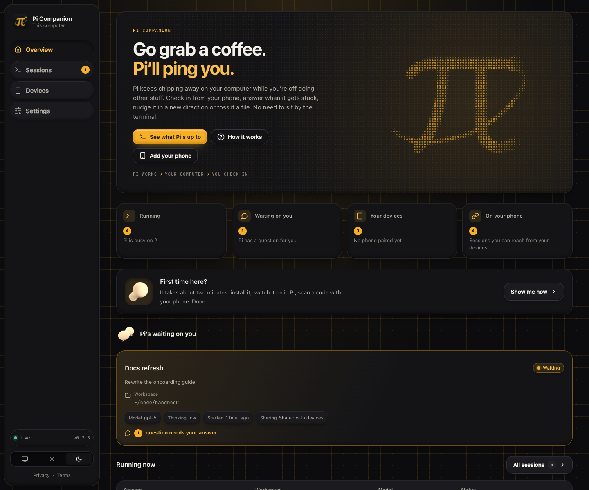

# Pi Companion

Lightweight, local-first remote control for Pi sessions.

Pi Companion is deliberately not another agent runtime. Pi owns execution and conversation state. A single Rust daemon owns session discovery, pairing, temporary file exchange, browser fan-out, and the embedded web UI.

The UI is a static SvelteKit application. There is no Node runtime in production and no Tauri shell. Rust embeds the generated frontend into the daemon binary.

## Install

    pi install npm:@ygrip/pi-companion

or straight from git:

    pi install git:github.com/ygrip/pi-companion

Then start pi as usual and run /companion to get the dashboard address. Nothing else to configure: the extension finds or starts the daemon on its own (see Daemon).

## Architecture

    local browser :43721
            |
            v
    +---------------------------+
    | pi-companion-server       |
    | single Rust daemon        |
    |                           |
    | live session registry     |
    | pairing/device registry   |
    | per-session temp sandbox  |
    +-------------+-------------+
                  |
          localhost WebSocket
        +---------+---------+
        v                   v
    Pi session A        Pi session B
    extension           extension

    paired phone
         |
      HTTPS/WSS
         |
    tunnel / reverse proxy
         |
         v
    remote surface :43722
         |
         +---- same daemon

The local administration surface and paired-device surface are separate listeners. If you expose Pi Companion through a tunnel, target only port 43722. Never expose port 43721.

## Daemon

There is exactly one daemon per machine, shared by every Pi session. The extension manages it with no configuration:

1. It probes http://127.0.0.1:43721. If anything answers (a daemon started by another session, or one you ran yourself with cargo run), it just connects. It never starts a second copy.
2. If nothing answers, one Pi session takes a lock (so several sessions starting at once don't race), launches the daemon detached, and waits for it to be ready. The others wait for that daemon.
3. If a live connection drops, the extension waits 20 seconds before launching a replacement, so restarting a dev daemon doesn't get pre-empted.
4. The daemon also refuses to run twice: if its ports are taken it prints a message and exits 0.

The daemon binary is resolved in this order:

| Order | Source |
|---|---|
| 1 | PI_COMPANION_SERVER (explicit path override) |
| 2 | a cargo build inside the package checkout: newest of server/target/release and server/target/debug |
| 3 | cached download: ~/.pi/agent/pi-companion/bin/<version>/ |
| 4 | pi-companion-server on PATH |
| 5 | download of the GitHub release matching the package version, verified against SHA256SUMS, then cached |

Optional environment variables (none are required):

| Variable | Effect |
|---|---|
| PI_COMPANION_SERVER | use this daemon binary |
| PI_COMPANION_URL | daemon WebSocket URL (default ws://127.0.0.1:43721); autostart only happens for loopback URLs |
| PI_COMPANION_AUTOSTART=0 | never launch a daemon, only connect |
| PI_COMPANION_PUBLIC_URL | daemon-side: public URL embedded in pairing QR codes |

Local admin:

    http://127.0.0.1:43721

Paired-device surface:

    http://127.0.0.1:43722

The remote listener is still loopback-only. Use an authenticated HTTPS tunnel or reverse proxy for access outside the machine.

Set the externally reachable paired-device URL before starting the daemon:

    PI_COMPANION_PUBLIC_URL=https://companion.example.com pi-companion-server

The configured public URL is used only to construct pairing invitations.

## Per-session remote control

Inside any Pi session:

    /remote-control

This toggles whether that session is visible and controllable from paired devices.

A paired device cannot access sessions that have not explicitly enabled remote control.

## Pairing

Pairing is daemon-wide rather than session-specific:

1. Open the local dashboard on port 43721.
2. Select Pair device.
3. The daemon creates a single-use invitation valid for five minutes.
4. The dashboard shows a short human-readable code and a QR containing the invitation URL.
5. Scan the QR on the phone.
6. The phone names itself and claims the invitation.
7. The daemon returns a long random device credential and stores only its SHA-256 hash.
8. The paired device appears on the local dashboard with its last-seen time and can be revoked there.

A phone pairs once with the daemon. Individual Pi sessions still opt in using /remote-control.

## Temporary files

Each session has an isolated temporary directory beneath the operating system temp directory:

    <temp>/pi-companion/<session-id>/

On Unix the daemon attempts to set the Pi Companion and session directories to mode 0700.

The browser can upload a file from the Files tab. Current constraints:

- 25 MiB maximum per upload
- filename is reduced to its final path component
- generated opaque file id prefixes the on-disk name
- the daemon never accepts a client-provided destination path
- file deletion accepts only the opaque file id
- deletion verifies the stored path is still inside that session sandbox
- sandbox content is removed 30 seconds after a disconnected session fails to reconnect

The Pi extension exposes:

    companion_temp_files

which returns the sandbox file paths available to the agent, and:

    companion_delete_temp_file

which destroys one temporary file by opaque id.

This means the agent can consume uploaded artifacts using its normal file capabilities while Pi Companion retains ownership of upload placement and cleanup.

## Session identity

Every registered Pi session publishes a compact display model to the daemon:

- session name
- short title
- status: active, idle, or stopped
- main model
- thinking effort
- working directory and process id
- remote-control state

Stopped sessions remain visible in the daemon registry so the dashboard does not lose context when a Pi process exits. Their controls are disabled and their temporary sandbox is cleaned after the reconnect grace period.

## UI

The dashboard uses a compact bento + shell visual system:

- bento cards for sessions, status, model/effort, files, and paired devices
- shell-like activity feed: streamed assistant text and thinking, tool calls with running/ok/error state, prompts and lifecycle markers
- inline answer cards for companion_ask_user questions, with option buttons
- colored git diff with working-tree and staged views
- accessible tabs (arrow keys), skip link, visible focus rings, polite live region for the feed
- mobile first-class: safe-area insets, 44px touch targets on coarse pointers, 16px inputs to avoid iOS zoom, sticky composer, snap-scrolling session rail
- responsive session rail that becomes horizontally scrollable on narrow screens
- warm amber visual language aligned with Raksara/Punakawan
- lightweight canvas dotfield inspired by Raksara, with focal density and smooth edge falloff
- dotfield start deferred until browser idle time, paused while hidden, and reduced under prefers-reduced-motion

SvelteKit is compiled with adapter-static to server/web-dist. CI builds that bundle once and Rust embeds it using rust-embed. Generated web-dist files are not committed.

## Browser controls

The initial slice supports:

- multiple live Pi sessions
- prompt
- steer
- abort
- /plan
- git diff
- streamed lifecycle/tool/message events
- companion ask-user requests
- temporary file upload/list/delete
- paired-device management
- per-session remote-control opt-in

There is deliberately no arbitrary shell, arbitrary tool invocation, or arbitrary filesystem API.

## Development

Requirements: Node 22+ and stable Rust.

    npm install
    npm run server:dev

Then, in another shell, start Pi with the extension from this checkout:

    pi -e ./src/index.ts

For hot-reloading UI work, keep the daemon running and use:

    npm run ui:dev

which proxies /api and /ws to the daemon on 43721.

Running the daemon manually with npm run server:dev and the extension side by side just works: the extension sees the running daemon and connects to it. If you don't run it, the extension launches your local cargo build automatically.

## Releases

The package carries the pi-package keyword, so published npm versions appear in the Pi package gallery (https://pi.dev/packages). Host-provided packages (@earendil-works/pi-coding-agent, typebox) are peer dependencies, as Pi requires.

GitHub Actions run only for release tags. Pushing ordinary commits or opening pull requests does not trigger any workflow; CI can also be started manually with workflow_dispatch.

A tag matching vX.Y.Z triggers both the CI and release workflows.

Before publishing, the workflow requires X.Y.Z to match both package.json and server/Cargo.toml. It then runs TypeScript and Rust checks, builds native daemon archives for Linux x86_64, macOS arm64, macOS x86_64, and Windows x86_64, generates SHA-256 checksums, and creates a GitHub Release.

If the repository has an NPM_TOKEN secret, the same validated tag also publishes @ygrip/pi-companion to npm with provenance. Without that secret, the native GitHub Release still proceeds.

## Security boundary

The design follows a few non-negotiable rules:

- local admin and remote device surfaces use different ports
- both listeners bind to loopback
- only the remote listener should ever sit behind a tunnel
- pairing invitations are single-use and expire after five minutes
- paired-device secrets are not stored in plaintext by the daemon
- remote devices only see sessions with remoteEnabled=true
- uploads are placed only in daemon-created session sandboxes
- file deletion is id-based and boundary checked
- there is no generic shell endpoint
- Pi remains the authority that performs agent actions

The current paired-device registry is process-local. Persistent encrypted/restricted device state and explicit origin checking are the next hardening step before treating this as a finished internet-facing product.

## Next hardening milestones

1. Persist device metadata and credential hashes in a 0600 state file.
2. Add strict Origin checks to the paired-device HTTP and WebSocket surface.
3. Add per-device session permissions in addition to session opt-in.
4. Bound browser event queues by both item count and bytes, dropping low-priority deltas first.
5. Add upload count/quota limits per session and optional MIME allowlists.
6. Add proper transcript rendering instead of raw event JSON.
7. Package signed/notarized daemon binaries and service installation for macOS/Linux/Windows.
8. Add protocol, pairing expiry, reconnect, traversal, upload-limit, and multi-session isolation tests.
