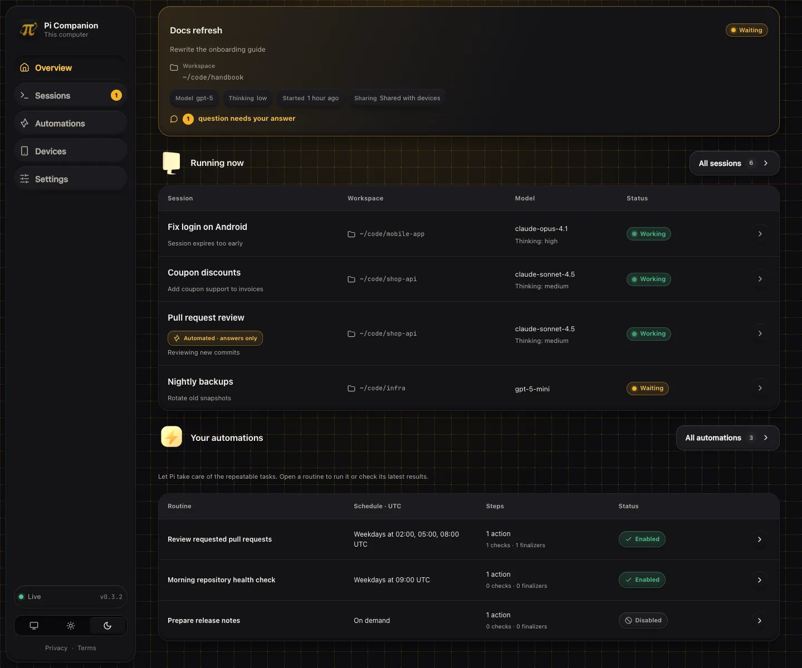
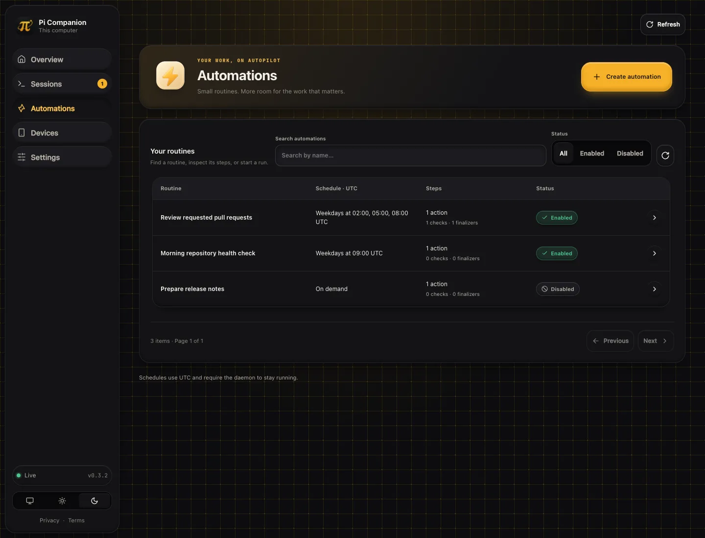
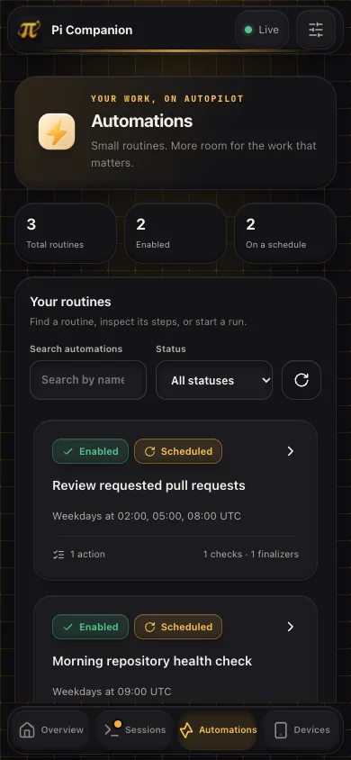
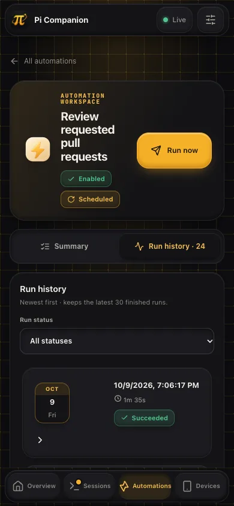
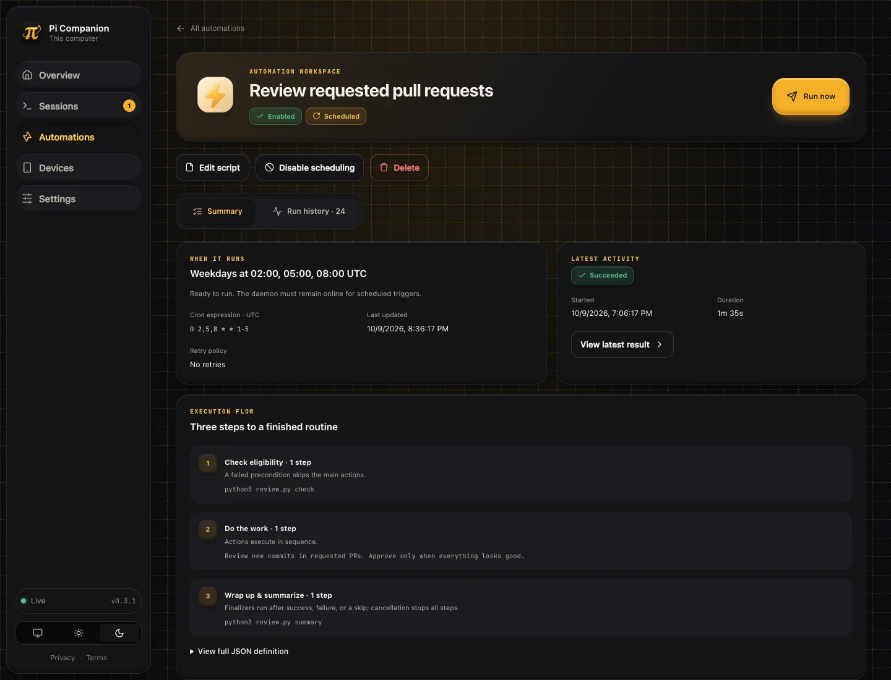
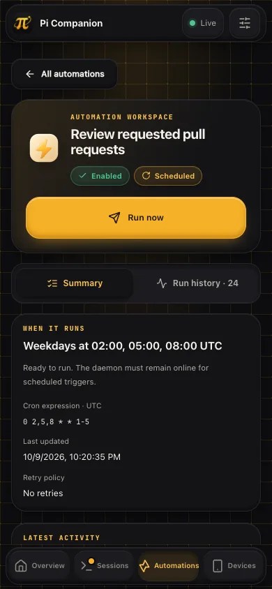
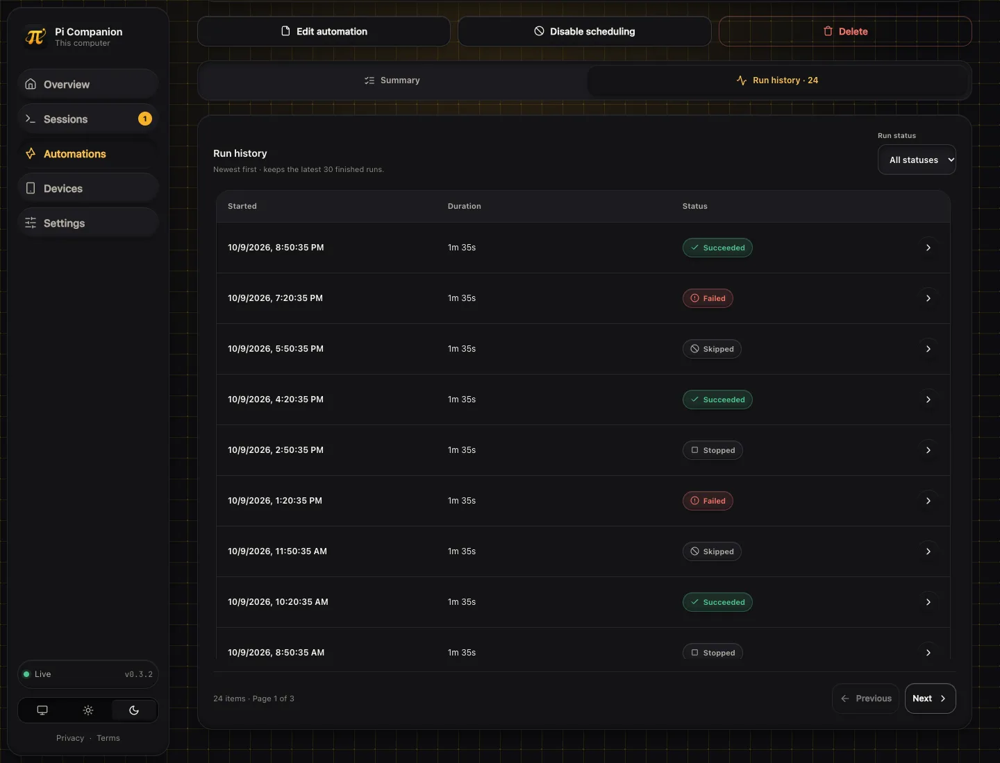
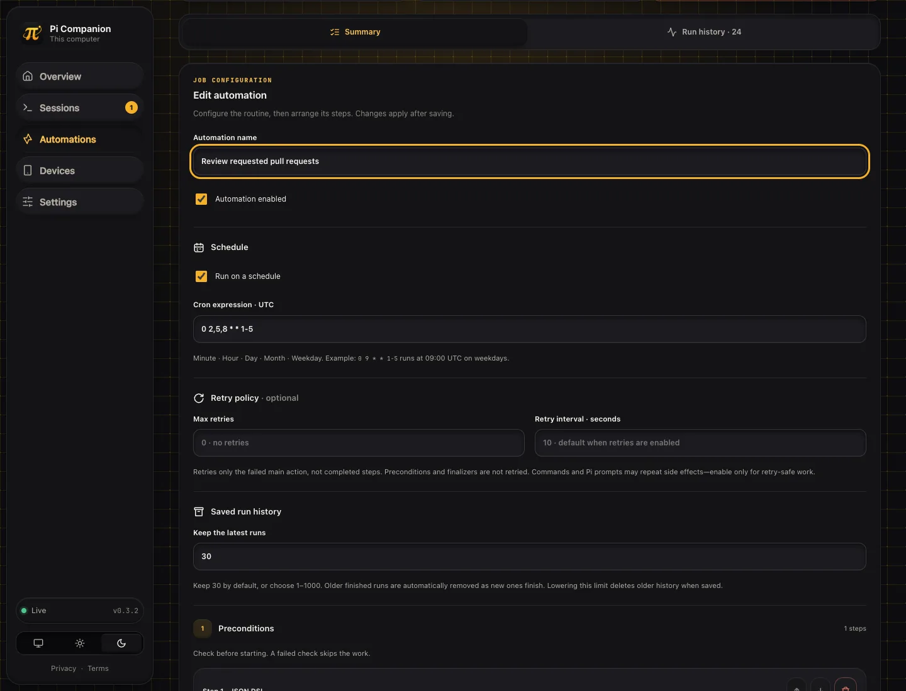
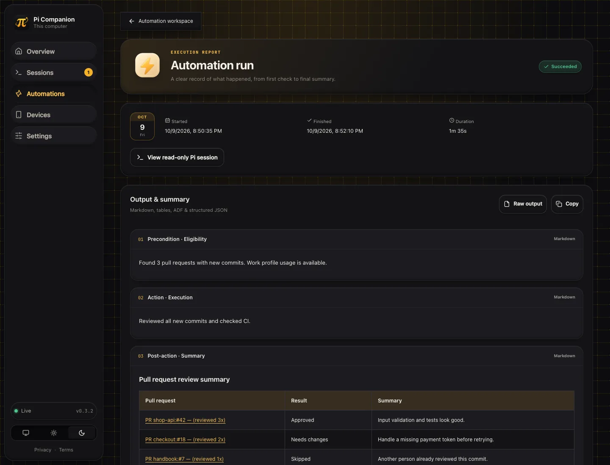
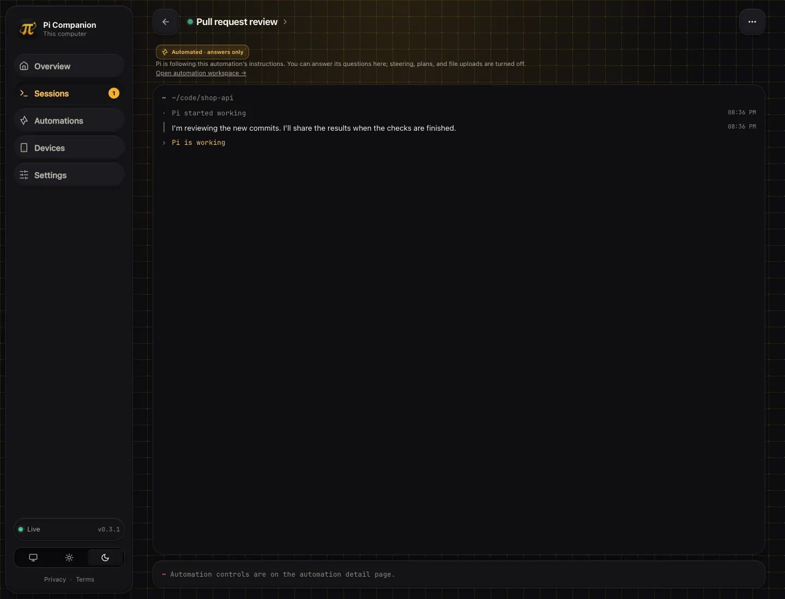

# Automations (0.3.2)

Automations are persisted, named JSON scripts run by the Companion daemon. Open **Automations** in the navigation to view definitions, start/stop runs, and inspect timestamped run history. Click a run to view its captured output and Pi summary. Desktop console users can create, edit, delete, and enable/disable definitions; mobile and paired-device users can only inspect and start/stop them.

## Workspace & editor

The claymorphic automation collection uses the same responsive tabular style as overview sessions, with rounded status chips, name search, segmented Enabled/Disabled filters, ten-item pagination, and a scrollable row region. Redundant statistic tiles are removed. On phones, rows stack their labelled fields without horizontal scrolling.

The detail workspace is a single-column bento layout with a clay back button and full-width run control below its title. **Summary** and **Run history** tabs fill the container. History is a newest-first responsive table with start time, duration, status filters, and ten-item pagination over each automation’s retained history (latest 30 finished runs by default, configurable 1–1000).

Choose **Edit automation** to reveal the editor at the top of Summary, automatically scroll it into view, and focus its name field. This keeps the routine context nearby without navigating to another page. Nothing changes until you save. Desktop console editing remains required.

Overview, Sessions, Automations, and Settings support pull-to-refresh from the top of the page and an accessible **Refresh** button. Pull down on non-interactive page content, then release when prompted. Nested scroll regions and form controls keep their own gestures. Settings refresh never discards unsaved edits.

The job editor separates name, enablement, UTC cron, optional retry policy, preconditions, actions, and post-actions. Each step is a reorderable JSON DSL object with Command/Pi templates. Saving validates the definition, cron ranges, action types, arguments, absolute directories, timeouts, step count, and retry bounds; the daemon validates again before persistence. Only computer desktop administrators can author definitions.

Run results have a formatted and raw view. Formatted results split daemon execution phases, render sanitized Markdown (including tables, links, code, and diagrams), recognise whole/fenced JSON, and render Atlassian Document Format (`type: "doc"`) or `{ "adf": ... }` documents. ADF supports headings, lists, marks, tables, panels, and safe links; unsupported nodes preserve their text, and attachments are placeholders. HTML/scripts and executable link protocols are not trusted. Raw output remains available for inspection and copying.

## Screenshots

Screenshots use only demo data. The same generator refreshes the existing overview, session, and mobile screenshots too.












## History retention

`historyLimit` is an optional integer **1–1000**, default **30**. Each automation retains its latest N finished runs, replacing older history as newer runs finish. Lowering the limit prunes older runs immediately on save; active runs are retained until finished. The same policy is applied on daemon startup. Deleted run results cannot be recovered from the dashboard. Run history pages show **10 items** at a time.

Automations also appear below running sessions on the overview. Automated sessions are labelled **Automated · answers only** in session cards, tables, and the session workspace. Their browser controls allow question answers but not steering, planning, uploads, or code changes; backend restrictions remain authoritative.

## Optional retries

`maxRetries` is an optional integer **0–5** (default **0**, no retries). `retryIntervalSeconds` is an optional integer **1–86400** (default **10 seconds**). Only a failed main action is retried; completed steps do not repeat, and precondition skips and finalizers are never retried. Stop cancels an active process or retry delay. Save-time validation requires the total retry-delay budget to be shorter than the shortest daily UTC trigger gap (a conservative bound for schedules limited to selected dates). Before each wait, the daemon also skips a retry that would reach the next scheduled trigger. It cannot guarantee action duration; overlapping runs remain prohibited. Attempt diagnostics are included in run output, and finalizers execute after the final outcome unless stopped.

**Retries can duplicate side effects**, including model calls and remote submissions after ambiguous failures. Enable them only for retry-safe work; the PR-review automation should keep retries off. Existing definitions without either field retain their original behavior.

## JSON DSL

```json
{
  "name": "Daily repository check",
  "enabled": true,
  "schedule": "0 9 * * 1-5",
  "maxRetries": 0,
  "retryIntervalSeconds": 10,
  "historyLimit": 30,
  "preconditions": [
    { "type": "command", "command": "git", "args": ["rev-parse", "--is-inside-work-tree"], "cwd": "/absolute/project" }
  ],
  "actions": [
    { "type": "command", "command": "npm", "args": ["test"], "cwd": "/absolute/project", "timeoutSeconds": 600 },
    { "type": "pi", "prompt": "Summarize the repository's current health. Do not edit files.", "cwd": "/absolute/project", "timeoutSeconds": 900 }
  ],
  "postActions": []
}
```

Commands run as executable + argv, not through an implicit shell. A nonzero precondition skips the main actions. Actions execute in order. Post-actions provide a finalization stage. `schedule: null` is manual-only; otherwise use five cron fields (minute, hour, day of month, month, day of week), evaluated in **UTC**. Scheduled execution requires the daemon to remain running; it does not catch up missed executions. A definition cannot have overlapping runs. Disabling scheduling and stopping a run are separate operations.

A Pi action starts `pi --mode rpc --no-session` in the specified directory. Pi must be on PATH and already configured with credentials/model settings. It exposes a read-only Companion session: the feed and questions are visible, but steering, prompts, plan changes, file uploads, and diffs are unavailable. This restriction applies to browser control, **not** the agent's own tools or filesystem access. Pi's final assistant output is stored in the run result. Supported RPC `select`, `confirm`, `input`, and `editor` questions are forwarded; terminal-only custom dialogs cannot be displayed. The native `companion_ask_user` tool falls back to these RPC dialogs for daemon-owned runs.

**Security:** automations run with the daemon user's operating-system privileges. They are not sandboxed. Paired devices can start an existing automation, including commands with side effects. Pair only devices you trust, and review commands, prompts, working directories, and schedules before saving/enabling a definition. Native agent tools and MCP management use the local admin surface; do not expose that surface publicly.

## Agent surface

The extension registers `companion_automation` and ships the `companion-automations` skill. Operations: `list`, `get`, `create`, `update`, `delete`, `enable`, `disable`, `start`, `stop`, `runs`, and `run`. Supply `id` except for list/create, a full `automation` definition for create/update, and `runId` for run detail.

```json
{"action":"create","automation":{"name":"Check","enabled":true,"schedule":null,"preconditions":[],"actions":[{"type":"command","command":"git","args":["status","--short"],"cwd":"/absolute/project"}],"postActions":[]}}
```

Tools only contact an already-running daemon. They never download/start one or activate sharing for a normal Pi session. Start Companion explicitly via `/companion` or `npm run serve` first. Inspect the final run status rather than assuming an accepted start means success.

## Standalone MCP

Node >=22.17 can run the shipped stdio MCP server, without an MCP SDK dependency:

```bash
pi mcp add companion-automations -- node --experimental-strip-types --no-warnings /absolute/path/to/pi-companion/src/automation-mcp.ts
```

Other MCP clients can configure the same executable and arguments. The server exposes `companion_automation` with the same schema as the native extension tool. Configure only one surface if you want to avoid duplicate tools. It uses the default local admin address, overridable with `PI_COMPANION_URL=ws://127.0.0.1:PORT`; non-loopback management targets are rejected.

## HTTP API

Admin console:

- `GET /api/automations` → `{automations}`; `POST` creates a definition.
- `GET /api/automations/{id}` → definition; `PUT` replaces it; `DELETE` removes it.
- `POST /api/automations/{id}/start` and `/stop`.
- `GET /api/automations/{id}/runs` → `{runs}`.
- `GET /api/automations/{id}/runs/{runId}` → run details including result.

The paired-device surface requires valid device authentication and allowed Origin, and exposes only GET/start/stop. Mobile layout is a UI restriction, not a separate authentication role; local console API callers remain administrators.

## Automatic archiving

Disconnected/stopped session records older than seven days are archived automatically. Live command channels, active/idle sessions, and recent disconnections are retained. Archiving removes only the daemon registry/feed entries, never the project, local Pi history, or files. Automation definitions and run history are independent of session archiving.
